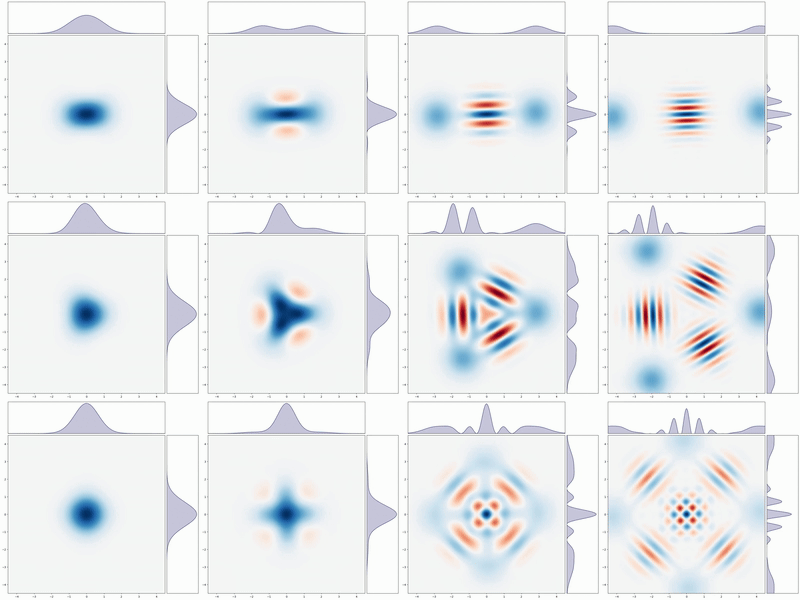

<h1 align="center">Praneel Gore</h1>
<h3 align="center">Working towards Neuromorphic Quantum Photonics</h3>

- 🔭 My recent research work on Multi perspective framework for Diagnostics of Hybrid Quantum Neural Networks is hosted as a preprint at Research Square : https://www.researchsquare.com/article/rs-7093575/v1
  Research Gate: https://www.researchgate.net/scientific-contributions/Praneel-Gore-2320201473
  Sciety: https://sciety.org/articles/activity/10.21203/rs.3.rs-7093575/v1

- Disappointed at how uninteresting the syllabus is I am teaching myself Neuromorphic computing, Photonic computing, Quantum computing from a Machine Learning perspective.
  - Based on a curated syllabus comprising Introduction to Quantum Computing (Hiu Yung Wong) + Spiking Neuron models (Wulfram Gerstner and Werner M. Kistler) + Quantum Machine Learning ( Peter Wittek) + Roadmap on Neuromorphic Photonics (100+ authors) + PennyLane Codebook + Quantum Country
  - And tools like pennylane (classical quantum computing simulation) + strawberry fields (photonic quantum simulations) + snntorch (neuromorphic simulations)
  - While a detailed roadmap and checkpoints are being maintained in a private repository.
  
- 👯 I’m looking to collaborate on research work at the intersection of Deep Learning, Neuromorphic computing, Photonic computing, Quantum Machine Learning. Bullish on photonic quantum computing (🔦⚛️🖥️)

Currently studying Bosonic QEC (Below animation: Wigner distribution of cat states, from wiki)

  

--------------
<h3 align="left">Connect with me:</h3>

  - 📫 How to reach me: praneelgore@gmail.com | 23f2002255@ds.study.iitm.ac.in

--------------
<h3 align="left">Languages and Tools:</h3>

  

  

  

  

  

  

  

  

<picture>
  <source media="(prefers-color-scheme: dark)" srcset="https://raw.githubusercontent.com/IAmPraneel/IAmPraneel/output/github-snake-dark.svg" />
  <source media="(prefers-color-scheme: light)" srcset="https://raw.githubusercontent.com/IAmPraneel/IAmPraneel/output/github-snake.svg" />
  
</picture>

  

